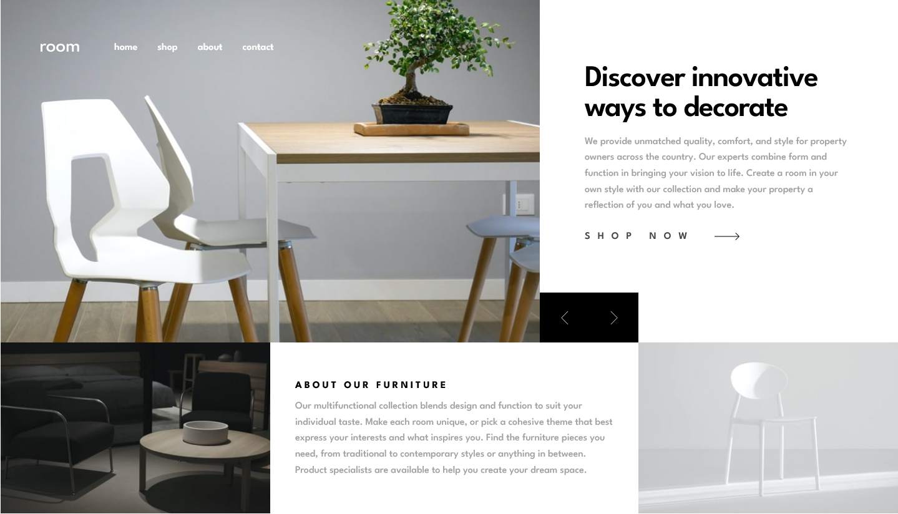

# Frontend Mentor - Room Homepage Solution

This is a solution to the Room Homepage challenge on Frontend Mentor. Frontend Mentor challenges help you improve your coding skills by building realistic projects.

## Table of contents

- [Overview](#overview)
  - [The challenge](#the-challenge)
  - [Screenshot](#screenshot)
  - [Links](#links)
- [My process](#my-process)
  - [Built with](#built-with)
  - [What I learned](#what-i-learned)
- [Author](#author)

## Overview

### The challenge

Users should be able to:

- View the optimal layout for the interface depending on their device's screen size
- See hover and focus states for all interactive elements on the page
- Navigate the hero image slider using the on-screen buttons or desktop keyboard arrow keys
- Toggle the mobile navigation menu drawer open and closed seamlessly

### Screenshot



### Links

- [Solution](https://github.com/Kking927/room-homepage)
- [Live Site](https://kking927.github.io/room-homepage/)

## My process

### Built with

- Semantic HTML5 markup
- CSS Custom Properties
- Flexbox and CSS Grid
- Responsive images using the `<picture>` element
- Vanilla JavaScript
- Accessibility-first development

### What I learned

During this project, I improved up my layout skills by using CSS Grid to build an asymmetric layout that adapts smoothly across different screen sizes.

I also focused on writing cleaner, more efficient JavaScript to handle the interactive parts of the site. For the slider, I used the remainder operator (%) to handle the cycling logic. This keeps the loop seamless and mathematically prevents the index from breaking out of bounds:
```js
nextBtn.addEventListener("click", () => {
  currentIndex = (currentIndex + 1) % slides.length; 
  updateSlide();
});

prevBtn.addEventListener("click", () => {
  currentIndex = (currentIndex - 1 + slides.length) % slides.length; 
  updateSlide();
});
```

To make the interface even more user-friendly, I hooked into global keyboard events so desktop users can cycle through the gallery using their physical arrow keys, reusing the slider logic I already wrote:
```
window.addEventListener('keydown', (e) => {
  if (e.key === 'ArrowRight') {
    nextBtn.click();
  } else if (e.key === 'ArrowLeft') {
    prevBtn.click();
  }
});
```

Finally, I wanted to make sure the site was accessible. I added a prefers-reduced-motion media query to ensure users with motion sensitivities can navigate safely.

```css
@media (prefers-reduced-motion: reduce) {
  .header__icon-hamburger,
  .header__icon-close,
  .header__logo,
  .is-open .header__nav-item::after,
  .hero-grid__btn,
  .hero-grid__btn img,
  .hero-grid__cta,
  .hero-grid__cta-arrow {
    transition: none;
  }

  .header__menu:hover .header__icon-hamburger,
  .header__menu:hover .header__icon-close,
  .hero-grid__btn--prev:hover img,
  .hero-grid__btn--next:hover img,
  .hero-grid__cta:hover .hero-grid__cta-arrow {
    transform: none;
  }
}
```

## Author

- Frontend Mentor - [@Kking927](https://www.frontendmentor.io/profile/Kking927)
